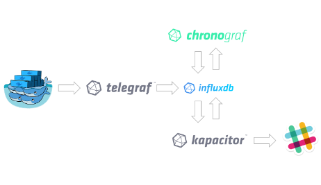

# Coding4Fun
## A propos de la stack TICK
---
@snap[north span-100]
# Objectif
@snapend

---
# Presentation de la stack TICK
+++
## TELEGRAF
+++
## INFLUXDB
+++
## CHRONOGRAF
+++
## KAPACITOR

---
# Installation la stack TICK avec Docker
+++
@snap[north span-100]
## Recupération d'une image influxdb
@snapend

@snap[midpoint span-100]
@box[bg-blue text-white waved box-padding](docker pull influxdb:lastest docker run -d -rm --name influxdb -p 8080:8080 - p8086:8086 influxdb)
@snapend
+++
## Recupération d'une image telegraf

+++
## Recupération d'une image Chronograf

---
# Amélioration de la stack TICK
+++
## Amélioration de TELEGRAF
+++
@snap[north span-100]
configuration du partage de fichier avec docker
@snapend

@snap[midpoint span-100]
@ol
- aller dans virtualbox pour désigner un dossier
- ouvrir un cmd ou powershell et exécuter la commande `docker-machine restart`
@olend
@snapend

+++
## Mise en place de Kapacitor

---
# Allez plus loin
